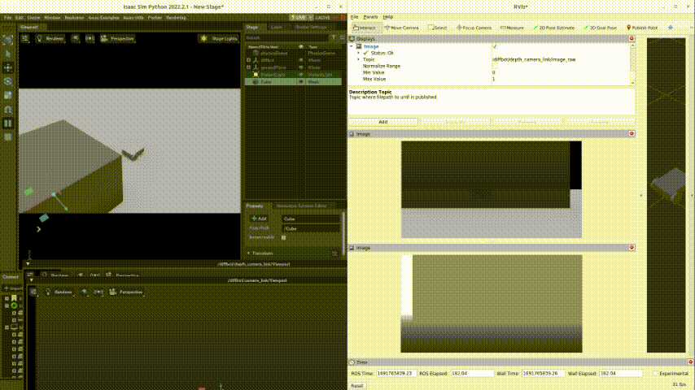

# isaac-ros2-control-sample
- ros2_control Demo
  
- LiDAR output Demo
  
- Camera output Demo
  
- Arm robot Demo
  

This repository shows how to control the robot from ros2_control to make Isaac Sim easier to use.
Important packages are "isaac_ros2_control" and "isaac_ros2_scripts". 
"isaac_ros2_control" provide hardware_interface class and send the commands from ros2_control to "isaac_ros2_scripts".
"isaac_ros2_scripts" is needed bacause Isaac Sim needs specific python environment.
"isaac_ros2_scripts" has the python script to launch and control Isaac Sim.

The features of this repository are below:
- This shows how to control a robot on Isaac Sim with ros2_control.
- This provides a Dockerfile where Isaac Sim and ROS2 Humble can coexist.
- This currently supports only rotational joints using velocity control.
- This sends joint status (position, velocity and effort) to ros2_control from Isaac Sim.
- This launches sensors from URDF description.
- This spawns URDF model at the desired timing and position.
- This launchs sensors and controller at the desired timing.

## Prerequisite
1. Docker
1. Isaac Sim Docker Image (Tested using image based on nvcr.io/nvidia/isaac-sim:2022.2.1)
1. Nucleus Server (I installed with the Omniverse Laungher)

## How to use
1. Install Docker and pull Isaac Sim Docker Image.
   refer to https://docs.omniverse.nvidia.com/app_isaacsim/app_isaacsim/install_container.html

2. Clone the repo to your ros2 workspace
   ```bash
   git clone https://github.com/hijimasa/isaac-ros2-control-sample.git
   ```

3. Get git submodules
   ```bash
   cd isaac-ros2-control-sample
   git submodule update --init --recursive
   ```

4. Build a docker image with shell script.
   ```bash
   cd docker
   ./build_docker_image.sh
   ```

5. Launch a docker container
   ```bash
   ./launch_docker.sh
   ```

6. Build ros2 source codes
   ```bash
   colcon build && source install/setup.bash
   ```

7. Launch the package
   7.1. For Mobile Robot
   - To launch simulator
   ```bash
   ros2 run isaac_ros2_scripts launcher
   ```

   - To spawn robot (another terminal)
   ```bash
   docker exec -it isaac-sim /bin/bash
   ros2 launch isaac_diffbot_sim diffbot_spawn.launch.py
   ```

   - To launch teleop_twist_keyboard (another terminal)
   ```bash
   docker exec -it isaac-sim /bin/bash
   ros2 run teleop_twist_keyboard teleop_twist_keyboard
   ```
   7.2. For Arm Robot
   - To launch simulator
   ```bash
   ros2 run isaac_ros2_scripts launcher
   ```

   - To spawn robot (another terminal)
   ```bash
   docker exec -it isaac-sim /bin/bash
   ros2 launch franka_moveit_config demo.launch.py 
   ```

> [!NOTE]
> For the first time, launching Isaac Sim takes a very long time.
> Isaac Sim must be fully launched to spawn the robot.


## Bug
- LaserScan topic do not published when 2D Lidar config file is used.
- You should uncheck "Normarize Image" in your depth topic in RViz2 if you get black depth image.
